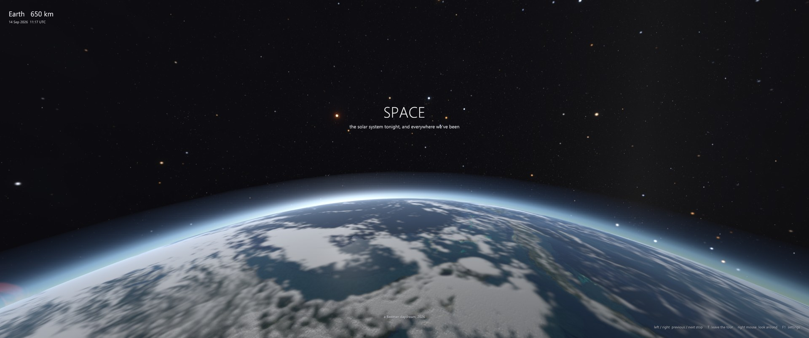
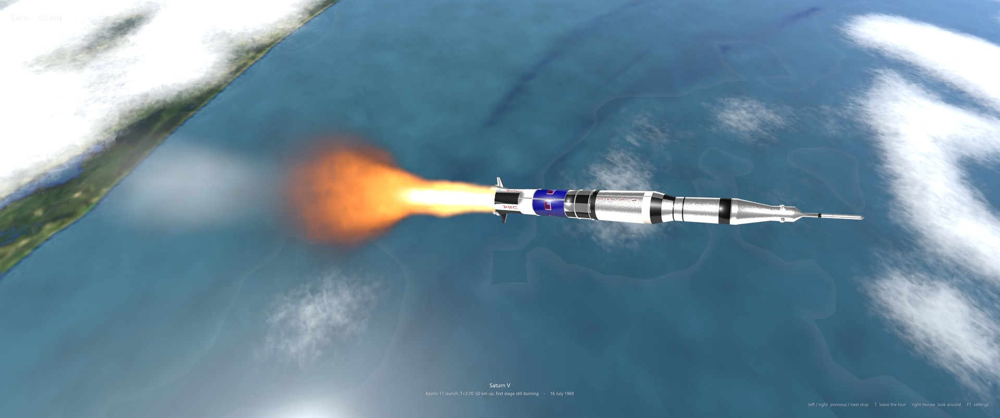
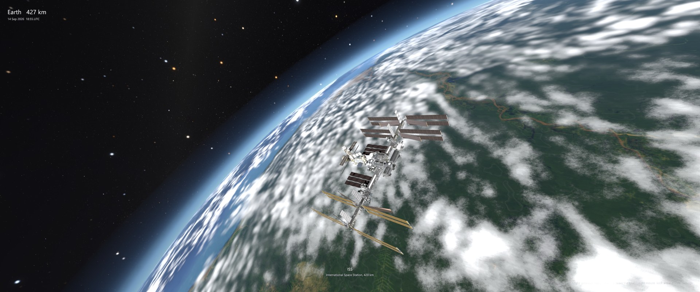
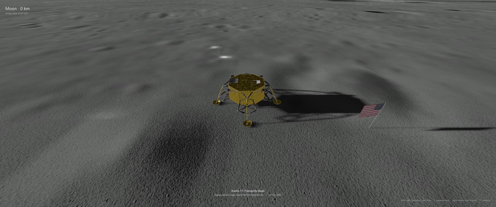
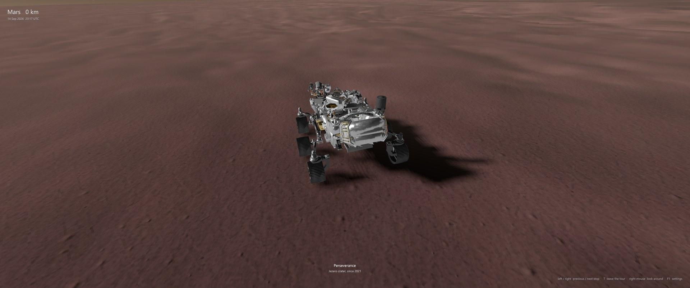
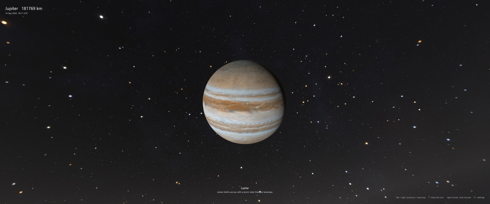
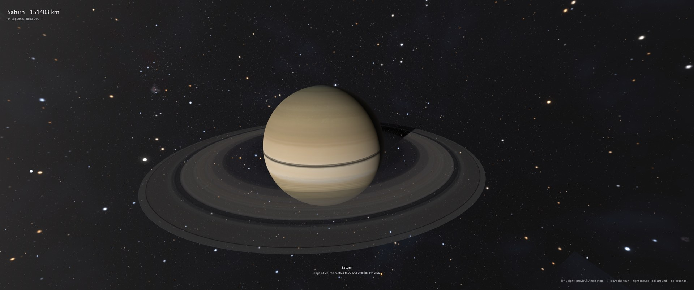
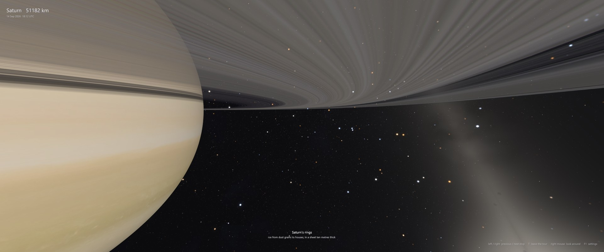
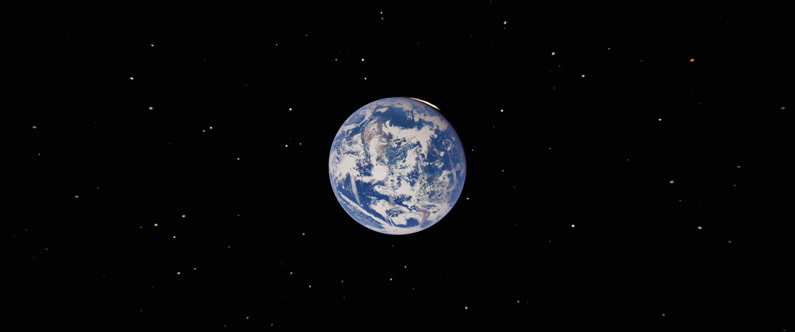

# Space

*the solar system tonight, and everywhere we've been*



Space is a photoreal solar-system explorer that runs on your own GPU. It puts the planets, moons and
spacecraft where they really are **right now** — today's cloud cover pulled from NASA satellites, the
ISS on this morning's orbital elements, tonight's lunar phase — and takes you on a cinematic tour of
the places people and their machines have been: a Saturn V two minutes into the Apollo 11 launch, the
station at 427 km, the descent stages still standing at Tranquility Base and Hadley Rille,
Perseverance on the floor of Jezero, Huygens on Titan, Voyager on its way out.

Everything is drawn from real data — Gaia stars, LRO and HiRISE terrain, USGS mosaics, NASA's own
spacecraft models — through a custom Vulkan 1.3 engine written for this project. No game engine, no
middleware beyond the NVIDIA DLSS SDK.

> A Beeman daydream, 2026.

## Gallery

| | |
|---|---|
|  |  |
| *Saturn V, T+2:20 — 60 km over the Atlantic, 16 July 1969* | *The ISS on today's TLE, with today's clouds* |
|  |  |
| *Tranquility Base: 50 cm LRO imagery, relief recovered from the photo's own shading* | *Jezero crater: 25 cm HiRISE orthoimage and 1 m stereo DTM* |
|  |  |
| *Jupiter* | *Saturn, rings translucent and backlit* |
|  |  |
| *Through the ring plane* | *Earth, water shaded as water, cloud tops volumetric* |

## What it does

- **Tonight's sky.** Planets and moons from JPL elements and Meeus' lunar theory for the current
  date; 2.5 million Gaia DR3 stars with real distances and colours; the 88 IAU constellations.
- **Live data at launch.** Today's cloud cover from NASA GIBS (MODIS/VIIRS) is fetched and blended
  into Earth's cloud layer; the ISS and Hubble fly on this morning's CelesTrak elements with J2
  node regression. Both refresh in the background and hot-swap in without a restart.
- **The tour.** A cinematic autopilot built to be comfortable — and VR-safe — by rule: the camera
  never rotates on its own, every leg is a cut (fade to black, reappear aimed at the next stop),
  approaches are straight lines at constant speed, roll is locked. Left/right arrows skip stops,
  right-mouse looks around, `T` leaves the tour. Historic stops carry their date.
- **Landing sites at 50 cm.** LRO NAC orthophotos and elevation models around all six Apollo sites,
  HiRISE around Perseverance. Because the photo's shading holds every boulder and crater the DTM
  cannot resolve, the bake recovers that relief photoclinometrically (the brightness residual along
  the Sun line is the ground's tilt) and relights it under tonight's Sun, with parallax occlusion,
  self-shadowing, an opposition surge, and centimetre regolith grain within a few metres.
- **Spacecraft.** NASA's public models — the 2.7 M-triangle ISS, Hubble, JWST, LRO, MRO, Juno,
  Parker, Voyager, Huygens, the LM descent stages with their flags — shaded with metallic-roughness
  PBR, casting sun-aligned shadows on the ground and on themselves. The Saturn V launch carries a
  ray-marched engine plume and a sunlit exhaust trail.
- **Atmospheres and light.** Single-scattering Rayleigh/Mie shells you can fly into (a Mars sky from
  the surface, Titan's haze), airglow, eclipses and transits by other bodies, ring shadows on Saturn,
  cloud shadows on the ground, night-side city lights and lightning, physically based bloom, Sun
  glare, motion blur, TAA or DLSS, scRGB HDR output.
- **Music.** Whatever is playing on the default output device is captured (WASAPI loopback) and
  analysed into 32 bands that breathe through the nebulae and dust — slow and continuous, never per
  beat.

## Tech stack

| Layer | Choice | Notes |
|---|---|---|
| Language | C++20 | ~9,000 lines of engine, ~2,600 of GLSL, ~2,000 of Python tooling |
| Graphics API | Vulkan 1.3 | dynamic rendering, synchronization2, bindless texture array (1024), push-constant heavy, no render passes |
| Memory | VulkanMemoryAllocator | |
| Upscaling / AA | NVIDIA DLSS Super Resolution (NGX SDK, Vulkan) | motion vectors from depth; falls back to the engine's own TAA |
| Output | scRGB RGBA16F swapchain on HDR displays, sRGB otherwise | ACES-style tonemap, physically based bloom chain |
| Precision | double-precision camera and body positions, camera-relative rendering | ray-traced spheres with `gl_FragDepth`, reversed-Z infinite projection, near-camera intersections solved against a double-precision surface anchor so the ground does not bob under a lander |
| Planets | exact-sphere ray tracing inside a proxy mesh | equirectangular maps up to 16K tiles, BC7/BC5/R16 DDS, local terrain patches, procedural craters and regolith below the data |
| Models | glTF 2.0 via cgltf, Draco, WebP | metallic-roughness PBR, 4096² sun-aligned shadow map |
| Volumetrics | ray-marched galactic medium, 16 catalogued nebulae, ray-marched rocket plume | |
| Stars | instanced point sprites, energy-conserving PSF, diffraction spikes for the brightest | AT-HYG (Gaia DR3 + Hipparcos + Tycho) |
| Audio | WASAPI loopback, 2048-point FFT | |
| UI | Dear ImGui (Segoe UI) | |
| Build | CMake + Ninja, vcpkg, MSVC 2022 | shaders compiled to SPIR-V by glslc at build time |
| Textures | DirectXTex on the GPU (`TexBake`, built alongside) | multi-GB source mosaics baked to mipmapped DDS once |
| Data tooling | Python: numpy, scipy, Pillow, OpenCV, rasterio-free PDS3/JP2 readers | fetch, crop and bake NASA/USGS products |

### Rendering path, per frame

```
shadow map (crafts)  ->  HDR scene at DLSS internal size:
                         sky -> galactic medium + nebulae -> bodies (ray-traced spheres, rings,
                         atmospheres) -> stars -> spacecraft -> plume -> dust
                     ->  motion vectors (compute)  ->  DLSS reconstruction to display size
                     ->  post (TAA when DLSS is off, Sun glare, motion blur)  ->  bloom chain
                     ->  tonemap to the swapchain  ->  ImGui overlay
```

## Data sources

| What | Source | Licence |
|---|---|---|
| Stars | [AT-HYG v3.2](https://github.com/astronexus/ATHYG-Database) (Gaia DR3, Hipparcos, Tycho-2) | CC BY-SA 4.0 |
| Constellations | Stellarium modern sky culture | CC BY-SA 4.0 |
| Earth | NASA Blue Marble Next Generation (500 m, bathymetry), Black Marble 2016 | public domain |
| Today's clouds | NASA GIBS, MODIS Terra corrected reflectance | public domain |
| Orbits | JPL approximate planetary elements; Meeus lunar theory; [CelesTrak](https://celestrak.org) TLEs | public domain |
| Moon | NASA CGI Moon Kit (LROC WAC colour, LOLA elevation) | public domain |
| Apollo sites | LROC NAC DTMs and 50 cm orthophotos (PDS) | public domain |
| Jezero | HiRISE DTM ESP_045994_1985 / ESP_046060_1985 and 25 cm orthoimage (UA / PDS) | public domain |
| Planets and moons | USGS Astrogeology mosaics: Mars (Viking, MOLA), Mercury (MESSENGER), Venus (Magellan SAR), the Galilean moons, Titan, Rhea, Triton, Phobos, Deimos | public domain |
| 8K fallback maps | Solar System Scope | CC BY 4.0 |
| Spacecraft | NASA 3D Resources, NASA Eyes on the Solar System | public domain |
| DLSS | NVIDIA DLSS SDK | NVIDIA licence, drop-in only |

Nothing above is in the repository (multi-GB); the scripts fetch and bake it.

## Requirements

- Windows 11, Visual Studio 2022 Build Tools (MSVC, CMake, Ninja)
- [Vulkan SDK](https://vulkan.lunarg.com/) 1.4+ (`winget install KhronosGroup.VulkanSDK`)
- [vcpkg](https://github.com/microsoft/vcpkg) at `..\vcpkg` or pointed to by `VCPKG_ROOT`
- Python 3.11+ with `numpy scipy pillow opencv-python-headless requests` for the data scripts
- An RTX GPU for DLSS (optional); developed on an RTX 5070 Ti at 3440x1440

## Build and run

```
scripts\build.cmd release --run
scripts\build.cmd debug          (validation layers on, console attached)
```

The first build downloads and compiles dependencies through vcpkg. Output lands in
`build\<preset>\Space.exe` with `shaders\` beside it; assets are read from the source tree.

### Getting the data

Each step is optional — whatever is missing falls back to the next best thing (8K maps, procedural
surfaces, the engine's own TAA). In order of impact:

```
python scripts\fetch_textures.py        8K maps, ~57 MB                       (a minute)
python scripts\fetch_models.py          NASA spacecraft models                (a few minutes)
curl -LO https://raw.githubusercontent.com/astronexus/ATHYG-Database/main/data/athyg_v32-1.csv.gz
curl -LO https://raw.githubusercontent.com/astronexus/ATHYG-Database/main/data/athyg_v32-2.csv.gz
python scripts\convert_athyg.py athyg_v32-1.csv.gz athyg_v32-2.csv.gz
python scripts\fetch_constellations.py
python scripts\bake_earth_hires.py      Blue Marble 16K tiles, ~3 GB VRAM     (~5 minutes)
python scripts\bake_moon_hires.py       LRO colour + LOLA relief              (~5 minutes)
python scripts\bake_planets_hires.py    USGS mosaics for Mars, Mercury, Venus, the moons (~8 GB of sources)
python scripts\bake_apollo_sites.py     LRO NAC + HiRISE landing-site patches (10-15 GB of sources)
```

`scripts\fetch_today.py` (clouds and orbital elements) runs by itself at launch when its data is stale.

For DLSS, copy the [NVIDIA DLSS SDK](https://github.com/NVIDIA/DLSS) into `external\dlss` as described
in `external\dlss\README.md` and rebuild.

## Controls

| Input | Action |
|---|---|
| Right mouse (hold) | Look around (on the tour the view eases back when released) |
| Left / Right arrow | Previous / next tour stop |
| T | Leave / rejoin the tour (the only key that stops it) |
| W A S D, R / F | Fly; up / down |
| Q / E | Roll |
| Scroll, Shift | Speed (exponential), 5x boost |
| 0-9 | Go to Sun, Mercury, Venus, Earth, Moon, Mars, Jupiter, Saturn, Uranus, Neptune (off the tour) |
| F1 | Settings panel: DLSS, exposure, HDR, time scale, music, constellations |
| Esc | Quit |

## Command-line switches

```
--windowed                1600x900 window instead of borderless fullscreen
--size <w> <h>            window size
--goto <Body|Craft>       start at a body or spacecraft (e.g. --goto Saturn, --goto ISS)
--surface <Body> <lat> <lon> <altKm>   start above a surface point
--no-tour / --tour-start <n> / --tour-pace <x>
--no-dlss / --dlss <0-4>  DLSS off, or performance .. DLAA
--sdr                     SDR swapchain even on an HDR display
--time-scale <days/s>     simulated days per real second (default 0.02)
--no-stars --no-bodies --no-volumetrics --no-sky --no-bloom
--diag / --diag-time <s>  dump HDR / bloom / swapchain frames for inspection
```

## Layout

```
src/core     window, input, logging
src/gfx      Vulkan context, swapchain, images, textures, glTF loading
src/render   frame orchestration, DLSS, bloom, post, ImGui
src/scene    solar system, spacecraft catalogue, camera, tour, star field, volumes, constellations
src/audio    WASAPI loopback capture and analysis
src/app      main loop, overlay, settings, live-data plumbing
shaders/     GLSL (planet, atmosphere, craft, plume, stars, nebula, post, bloom, motion)
scripts/     fetch and bake pipelines for every data source above
tools/       TexBake (DirectXTex GPU compressor)
external/    NVIDIA DLSS SDK drop-in
docs/        PLAN.md (the build plan), ROADMAP.md, screenshots
```

## Status and roadmap

Everything in the gallery runs today at 3440x1440 on a single RTX 5070 Ti. Next up, in
`docs/ROADMAP.md`: VR (OpenXR — the tour was designed for it), DLSS Frame Generation and Reflex,
ray-traced planet shadows, precomputed multiple-scattering atmospheres, exact JPL ephemerides, and
tour paths through the nebulae.

## Credits

Built by Charles Beeman with Claude as a pair programmer. Imagery and models are the work of NASA,
USGS, JPL, LROC/ASU, HiRISE/UA, ESA Gaia, and the AT-HYG and Stellarium communities — see the data
table for each source and licence.
